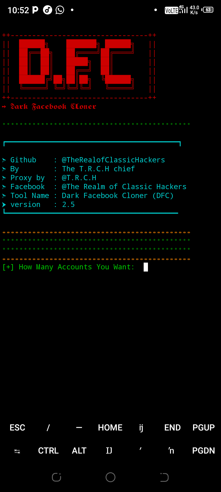
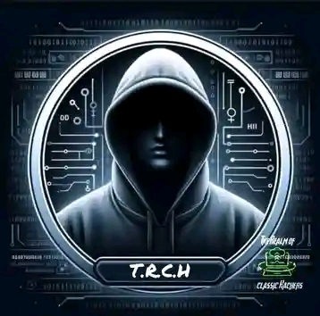

# Dark Facebook Cloner (DFC)


[](https://github.com/TheRealofClassicHackers/Dark_Facebook_Clone/stargazers)
[](https://github.com/TheRealofClassicHackers/Dark_Facebook_Clone/fork)
[](https://github.com/TheRealofClassicHackers/Dark_Facebook_Clone/issues)
[](https://www.facebook.com/profile.php?id=61555424416864)

---

## What is Dark Facebook Cloner?

**Dark Facebook Cloner (DFC)** is an automated tool that attempts to create and register multiple Facebook accounts using randomly generated user data and temporary email addresses. It leverages public APIs and proxy networks to automate the registration process, providing users with access tokens and account credentials for each generated account.

---

## What Does It Do?

- **Bulk Facebook Account Creation:** Automates the process of generating multiple Facebook accounts.
- **Random Data Generation:** Uses [Faker](https://faker.readthedocs.io/) to create realistic names, birthdays, and other user details.
- **Temporary Email Usage:** Integrates with the [mail.tm](https://mail.tm) API to create disposable email addresses for registration.
- **Proxy Support:** Tests and uses a list of proxies to avoid IP rate limits and bans.
- **Result Logging:** Saves generated account credentials and tokens to a local file.

---

## How Does It Work?

1. **Proxy Validation:**
   - Loads proxies from a file (`proxies.txt`).
   - Tests all proxies and selects only those that work with mail.tm.

2. **Temporary Email Creation:**
   - Uses the mail.tm API to create new, random email addresses for each account.

3. **Random User Data:**
   - Generates random first/last names, passwords, birthdays, and gender for every account using Faker.

4. **Automated Facebook Registration:**
   - Sends a registration request to the Facebook mobile API using the generated email and user data.
   - If successful, retrieves and saves the Facebook user ID and access token.

5. **Logging:**
   - Stores all generated account details and tokens in `username.txt`.

---

## Limitations

- **For Educational Purposes Only:** This tool is provided for research and educational purposes. **Do not use for unethical or illegal activities.**
- **No Guarantees:** Facebook's registration process/anti-bot systems may block or limit success rate at any time.
- **Proxy Dependency:** Requires a good list of working proxies to avoid bans and rate limits.
- **API Changes:** If Facebook or mail.tm update their APIs, the tool may break.
- **Responsibility Disclaimer:** _The author is **not responsible** for any misuse or damages caused by this tool._

---

## How to Use

### 1. **Clone the Repository**
```bash
git clone https://github.com/TheRealofClassicHackers/Dark_Facebook_Clone.git
cd Dark_Facebook_Clone
```

### 2. **Install Requirements**
```bash
pip install -r requirements.txt
```
_Requirements: `requests`, `colorama`, `faker`_

### 3. **Prepare Proxies**
- Place your proxies (one per line) in a file called `proxies.txt` in the repo directory.

### 4. **Run the Tool**
```bash
python Dark_Facebook_Clone.py
```
- Input the number of accounts you want to create when prompted.

### 5. **Check Results**
- Generated account details are saved in `username.txt`.

---

## Screenshot



---

## Logo



---

## Contact

[](https://github.com/TheRealofClassicHackers/Dark_Facebook_Clone/stargazers)
[](https://github.com/TheRealofClassicHackers/Dark_Facebook_Clone/fork)
[](https://www.facebook.com/profile.php?id=61555424416864)

---

## Disclaimer

```txt
━━━━━━━━━━━━━━━━━━━━Note━━━━━━━━━━━━━━━━━━━━
➔ I have no responsibities to any damage made by this tool  
➔ Please use this tool responsibly
➙ Please Remember to follow us on Facebook
➙ Make sure you have a strong and secure network connection
➔ Use Responsibly
➔ yeah i think that all ×͡×
━━━━━━━━━━━━━━━━━━━━━━━━━━━━━━━━━━━━━━━━━━━━
```

---

## Author & Contact

- **GitHub:** [@TheRealofClassicHackers](https://github.com/TheRealofClassicHackers)
- **By:** The T.R.C.H chief
- **Facebook:** [@The Realm of Classic Hackers](https://www.facebook.com/profile.php?id=61555424416864)

---

> **Please use this tool only for legal and ethical purposes!**
